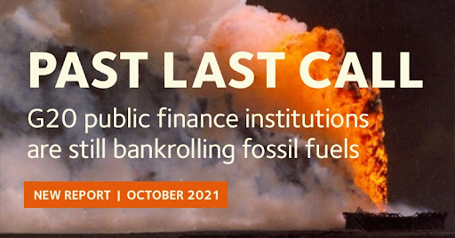

# Resources

The Public Finance for Energy Database is a project of Oil Change International to reveal the true cost of fossil fuels and facilitate the ongoing transition to clean energy. You can read the latest fossil free public finance campaign updates and press releases [on our website](https://priceofoil.org/). Below you can find direct links to some of our research related to international public finance.

### Research Spotlight

[Past Last Call](https://priceofoil.org/2021/10/28/past-last-call-g20-public-finance-institutions-are-still-bankrolling-fossil-fuels/) (2021) is the most recent analysis of our G20 international public finance dataset from Oil Change International and Friends of the Earth US. This report provides an update to previous reports [Still Digging](http://priceofoil.org/2020/05/27/g20-still-digging/) (2020) and [Talk is Cheap](http://priceofoil.org/2017/07/05/g20-financing-climate-disaster/) (2017) detailing earlier trends. 

  

&nbsp;

## Additional Research & Resources

### Energy Access

- [Distributed Funds for Distributed Renewable Energy: Ensuring African Energy Access Finance Reaches Local Actors](https://priceofoil.org/2020/07/21/distributed-renewable-2020/) (2020)
- [Shortchanging Energy Access: A Progress Report on Multilateral Development Bank Finance](http://priceofoil.org/2018/10/10/shortchanging-energy-access-report-mdb-finance/) (2018)
- [Assessing International Public Finance for Energy in Africa: Where Do Development and Climate Priorities Stand?](http://priceofoil.org/2018/07/23/assessing-international-public-finance-for-energy-in-africa/) (2018)

### Export Credit Agencies
- [Export finance for the past or the future? Why E3F member countries must end oil and gas financing and finance a climate-compatible future](http://priceofoil.org/2021/11/22/new-research-e3f-countries-need-to-shift-their-eur-19-billion-in-export-finance-for-fossil-fuels-to-renewables/) (2021)
- [Briefing for Policy Makers: An agenda for greening Export Credit Agencies in 2021](http://priceofoil.org/content/uploads/2021/04/Briefing-for-Policy-Makers_-Greening-Export-Credit-Agencies.pdf) (2021)
-[Legal opinion: Export credit agencies and states potentially at risk of climate litigation over finance for fossil fuels](http://priceofoil.org/2021/05/04/press-release-eca-legal-opinion/)

### Development Finance
- [Still Funding Fossils: An assessment of MDBs' energy finance since Paris and in COVID-19 recovery](https://bigshiftglobal.org/MDB-finance-2020) (2020)
- [Step Off the Gas: International public finance, natural gas, and clean alternatives in the Global South](https://www.iisd.org/system/files/2021-06/natural-gas-finance-clean-alternatives-global-south.pdf) (2021)

### Public finance as a component of fossil fuel subsidies
- [Doubling Back and Doubling Down: G20 Scorecard on Fossil Fuel Funding](http://priceofoil.org/2020/11/09/g20-scorecard-2020/) (2020)
- [BloombergNEF Climate Policy Factbook COP26 edition](https://about.bnef.com/blog/g-20-fossil-fuel-support-hits-nearly-600-billion-in-2020/) (2021)
- [The Production Gap: Governments’ planned fossil fuel production remains dangerously out of sync with Paris Agreement limits](https://productiongap.org/2021report/) (2021)